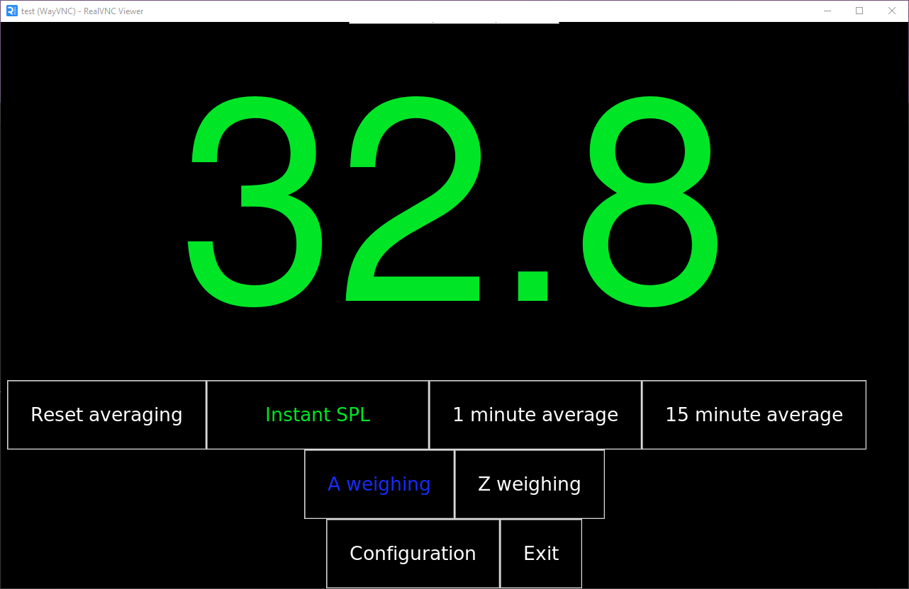

# Concert SPL Monitor


[← go to mechanical page](https://github.com/MiCyg/simple-concert-monitor_Mechanical)

---

Python-based SPL monitoring software for Raspberry Pi.

<p align="center">
	
</p>

## Prerequisites

- Raspberry Pi OS
- Python 3.9+ recommended
- Update system packages:
```bash
sudo apt update && sudo apt upgrade
````

* Install PortAudio:

```bash
sudo apt install portaudio19-dev
```

## Microphone setup (I2S)

1. Edit configuration file:

```bash
sudo nano /boot/firmware/config.txt
```

2. Uncomment:

```ini
dtparam=i2s=on
```

3. Add:

```ini
dtoverlay=googlevoicehat-soundcard
```

4. Reboot:

```bash
sudo reboot
```

5. Audio device check
```bash
arecord -l
```

## Setup

Create and activate virtual environment, then install dependencies:

```bash
python3 -m venv .venv
source .venv/bin/activate
pip install -r requirements.txt
```

## Run

```bash
python concert_spl_monitor.py
```

## Default PIN

After the first run, the application creates a `config` directory containing three configuration files:
- `meas.json`
- `pass.json`
- `sounddevice.json`
The default PIN is defined in `pass.json`. 
You can change the PIN after the first run by editing the `pin` property inside the `pass.json` file.


## Autostart on Boot (GUI – systemd user service)

For GUI applications on Raspberry Pi, use a **user-level systemd service** instead of a system-wide service.

### 1. Create user systemd directory

```bash
mkdir -p ~/.config/systemd/user
```

---

### 2. Create service file

```bash
nano ~/.config/systemd/user/concert-spl-monitor.service
```

Insert:

```ini
[Unit]
Description=Concert SPL Monitor
After=graphical-session.target

[Service]
WorkingDirectory=/home/USERNAME/Documents/simple-concert-monitor
ExecStart=/home/USERNAME/Documents/simple-concert-monitor/.venv/bin/python /home/USERNAME/Documents/simple-concert-monitor/concert_spl_monitor.py
Restart=always

[Install]
WantedBy=default.target
```

Replace `USERNAME` with your actual username.

---

### 3. Enable lingering (required)

This allows the user service to start at boot:

```bash
sudo loginctl enable-linger USERNAME
```

---

### 4. Enable and start the service

```bash
systemctl --user daemon-reload
systemctl --user enable concert-spl-monitor.service
systemctl --user start concert-spl-monitor.service
```

---

### 5. Check status

```bash
systemctl --user status concert-spl-monitor.service
```

---

### 6. View logs

```bash
journalctl --user -u concert-spl-monitor.service -f
```

